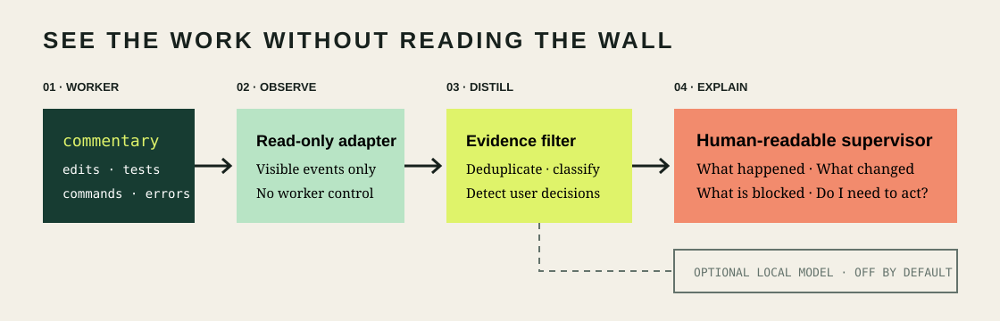

# CODEX SUPERVISOR

A local, read-only dashboard that turns coding-agent activity into a concise human progress view.

> **Alpha:** the Codex adapter currently reads Codex rollout JSONL, an internal format that may change. The dashboard never edits watched projects or sends messages to worker tasks.

## Quick start

```bash
python3 supervisor.py
```

Open <http://127.0.0.1:8765>, choose a task, and select **Observe**. Captured events remain in memory; Codex Supervisor creates no secondary activity log.

The Codex adapter automatically uses the shared control socket when available and otherwise starts its own read-only stdio app-server. Set `SUPERVISOR_CODEX_TRANSPORT=proxy` or `stdio` only when you need to override that detection.



Codex Supervisor follows one read-only path: discover a task, observe its existing local feed, discard hidden reasoning and low-value repetition, derive explicit state, then display a concise update. Optional Ollama interpretation is experimental and disabled by default.

## What it observes

- Externally displayed agent commentary and final responses.
- Tool calls and results, including build and test evidence.
- File paths explicitly present in observable events.
- Waiting-for-user language and completion evidence.

It does **not** expose hidden chain-of-thought, approve actions, modify projects, send steering messages, or persist a copied task history.

## Optional local model

The default interpreter is deterministic. If Ollama is already installed, opt into experimental local analysis with `SUPERVISOR_USE_OLLAMA=1 python3 supervisor.py`. No cloud model or paid API is required.

## Portability

Python and the web UI are cross-platform. Each coding agent needs an adapter that can discover its local tasks and read an authorized, externally visible event source. The first adapter targets Codex and currently depends on Codex's local rollout layout.

## Development

Run `python3 -m unittest discover -s tests` and `python3 -m py_compile supervisor.py`.

See [architecture](docs/architecture.md), [contributing](CONTRIBUTING.md), and [security](SECURITY.md).
